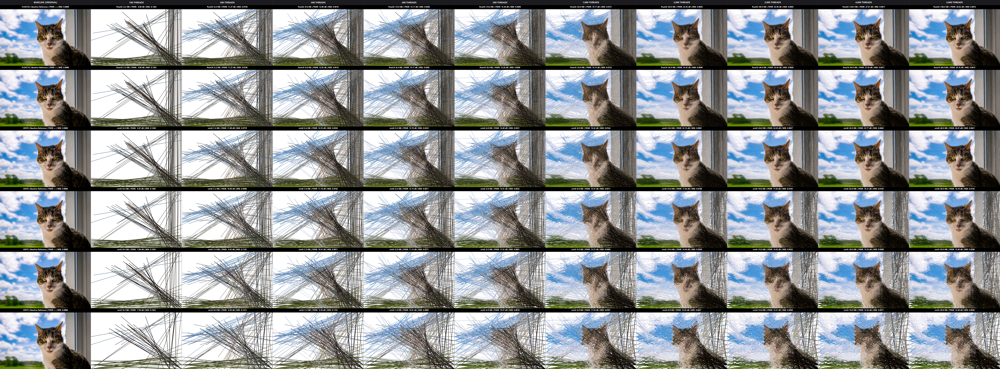

# Digital Filography

In this work, we study digital filography, a method that represents images using straight threads instead of pixel grids (bitmaps). Specifically, we evaluate the minimum thread count needed for accurate recognition by vision-language models (VLMs), traditional computer vision (CV) models, and human subjects.

Each thread is a vector with 8 elements:

$$T_i = [x_1, y_1, x_2, y_2, r, g, b, a]$$

Where:

* $(x_1, y_1)$ and $(x_2, y_2)$ are the start and end coordinates of the thread.
* $(r, g, b)$ sets the red, green, and blue (RGB) color values.
* $a$ is the alpha (opacity) value.

All values are normalized to the range $[0, 1]$.

An image with $N$ threads is stored as an $N \times 8$ matrix, with one thread per row:

$$I = \begin{bmatrix} T_1 \\ T_2 \\ \vdots \\ T_N \end{bmatrix} \in [0, 1]^{N \times 8}$$

Threads are rendered in sequential order from $1$ to $N$. Because recognition relies on dominant outlines rather than exact color mixing, changing thread draw order does not noticeably affect recognition.

### Quantization & Precision Benchmark Table

The table below evaluates reconstruction quality, storage requirements, generation runtime, and computational complexity across **10 thread counts** ($100$ to $5{,}000$) and **6 precision tiers** (`float32`, `float16`, `uint8`, `uint6`, `uint5`, `uint4`).

Tests should include:
- Object class (not just cats — dogs, people, cars, furniture, etc.)
- Number of objects per image
- Scale / occlusion / viewpoint
- Background complexity
- Lighting and image quality
- Different original resolutions